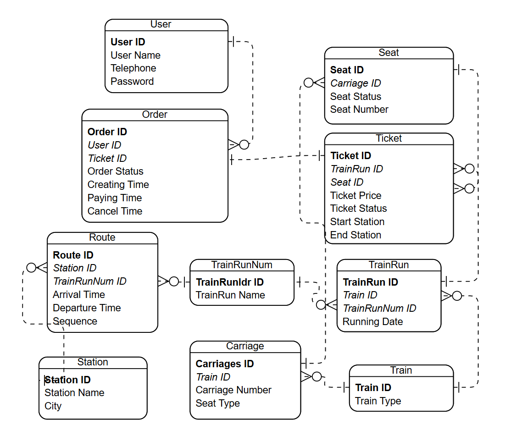

# 火车售票管理系统后端
基于**FastAPI**的后端项目，第一次写后端项目感觉难度不小
现在还在设计表格，建立模型

---

## 数据表设计

### 1. **用户表（Users）**  
记录用户基本信息。

| **字段名称**      | **类型**      | **描述**                 |
|-------------------|--------------|-------------------------|
| `用户ID`         | 主键 `int`  | 用户唯一标识符          |
| `用户名`         | `varchar`    | 用户姓名                |
| `联系方式`       | `varchar`    | 手机号或邮箱            |
| `哈希密码`       | `varchar`  | 哈希处理后的用户密码            |

---

### 2. **订单表（Orders）**  
记录订单信息，每个订单关联一个用户和一个车票。

| **字段名称**      | **类型**      | **描述**                           |
|-------------------|--------------|------------------------------------|
| `订单ID`         | 主键 `int`  | 订单唯一标识符                     |
| `用户ID`         | 外键 `int`  | 关联用户表                         |
| `车票ID`         | 外键 `int`  | 关联车票表                         |
| `订单状态`       | 枚举         | `待支付/已完成/已取消`             |
| `创建时间`       | `timedate`  | 订单创建时间                       |
| `支付时间`       | `timedate`  | 订单支付时间                       |
| `取消时间`       | `timedate`  | 订单取消时间                       |

---

### 3. **车票表（Tickets）**  
记录每张车票的详细信息，包括车次、座位等。

| **字段名称**      | **类型**      | **描述**                           |
|-------------------|--------------|------------------------------------|
| `车票ID`         | 主键 `int`  | 车票唯一标识符                     |
| `车次ID`         | 外键 `int`  | 关联车次表                         |
| `座位ID`         | 外键 `int`  | 关联座位表                         |
| `票价`           | `int`    | 车票价格                           |
| `车票状态`       | 枚举         | `已售/可用/已使用`                   |
| `起始站台`       | `varchar`    | 起始站台            |
| `终末站台`       | `varchar`    | 终点站台            |

---

### 4. **车次表（TrainRuns）**  
记录具体的车次实例，与路线和列车绑定。

| **字段名称**      | **类型**      | **描述**                           |
|-------------------|--------------|------------------------------------|
| `车次ID`         | 主键 `int`  | 每个车次唯一标识符                 |
| `列车ID`         | 外键 `int`  | 关联列车表                         |
| `车次标识ID`       | 外键 `int`    | 关联车次标识表                   |
| `发车日期`       | `datetime.data`       | 车次的实际发车日期         |

---

### 5. **列车表（Trains）**  
记录实际列车信息，与车厢绑定。

| **字段名称**      | **类型**      | **描述**                           |
|-------------------|--------------|------------------------------------|
| `列车ID`         | 主键 `int`  | 列车唯一标识符                     |
| `列车类型`       | `varchar`    | 列车类型（如高铁/普铁）            |

---

### 6. **车厢表（Carriages）**  
记录列车中每节车厢的配置。

| **字段名称**      | **类型**      | **描述**                           |
|-------------------|--------------|------------------------------------|
| `车厢ID`         | 主键 `int`  | 每节车厢唯一标识符                 |
| `列车ID`         | 外键 `int`  | 关联列车表                         |
| `车厢号`         | `int`        | 车厢编号                           |
| `车厢类型`         | 枚举     | `商务/一等/二等`                |

---

### 7. **座位表（Seats）**  
记录车厢内的具体座位情况。

| **字段名称**      | **类型**      | **描述**                           |
|-------------------|--------------|------------------------------------|
| `座位ID`         | 主键 `int`  | 每个座位唯一标识符                 |
| `车厢ID`         | 外键 `int`  | 关联车厢表                         |
| `座位编号`       | `varchar`    | 如"1A", "2B"等                     |
| `座位状态`       | 枚举         | `空闲/已预订`                      |

---

### 8. **车次标识表（TrainRunINum）**  
记录具体的车次实例，与路线和列车绑定。

| **字段名称**      | **类型**      | **描述**                           |
|-------------------|--------------|------------------------------------|
| `车次标识ID`         | 主键 `int`  | 每个车次标识唯一标识符          |
| `车次标识`       | `varchar`    | 车次标识（如G1234）  |

---

### 9. **车站表（Stations）**  
记录所有车站信息，包括车站名称和位置。

| **字段名称**      | **类型**      | **描述**                           |
|-------------------|--------------|------------------------------------|
| `车站ID`         | 主键 `int`  | 每个车站唯一标识符                 |
| `车站名称`       | `varchar`    | 车站名称                           |
| `城市`           | `varchar`    | 车站所在城市                       |

---

### 10. **站点表（Routes）**  
记录车次经过的所有车站及其时间信息。

| **字段名称**      | **类型**      | **描述**                           |
|------------------|--------------|------------------------------------|
| `站点ID`         | 主键 `int`  | 每条路线唯一标识符                 |
| `车站ID`         | 外键 `int`  | 关联车站表                         |
| `车次标识ID`         | 外键 `int`  | 关联车次标识表                   |
| `到站时间`       | `timedate`  | 列车到达车站的时间                 |
| `发车时间`       | `timedate`  | 列车离开车站的时间                 |
| `站点序号`       | `int`        | 车站在该路线中的顺序               |

---

### E-R图

---